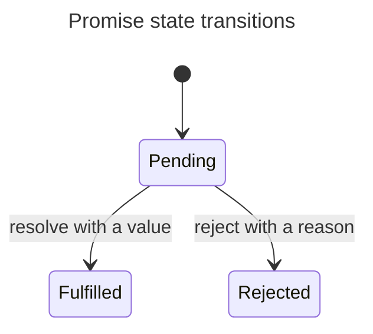

<!--VITE PLUS START-->

# Using Vite+, the Unified Toolchain for the Web

This project is using Vite+, a unified toolchain built on top of Vite, Rolldown, Vitest, tsdown, Oxlint, Oxfmt, and Vite Task. Vite+ wraps runtime management, package management, and frontend tooling in a single global CLI called `vp`. Vite+ is distinct from Vite, but it invokes Vite through `vp dev` and `vp build`.

## Vite+ Workflow

`vp` is a global binary that handles the full development lifecycle. Run `vp help` to print a list of commands and `vp <command> --help` for information about a specific command.

### Start

- create - Create a new project from a template
- migrate - Migrate an existing project to Vite+
- config - Configure hooks and agent integration
- staged - Run linters on staged files
- install (`i`) - Install dependencies
- env - Manage Node.js versions

### Develop

- dev - Run the development server
- check - Run format, lint, and TypeScript type checks
- lint - Lint code
- fmt - Format code
- test - Run tests

### Execute

- run - Run monorepo tasks
- exec - Execute a command from local `node_modules/.bin`
- dlx - Execute a package binary without installing it as a dependency
- cache - Manage the task cache

### Build

- build - Build for production
- pack - Build libraries
- preview - Preview production build

### Manage Dependencies

Vite+ automatically detects and wraps the underlying package manager such as pnpm, npm, or Yarn through the `packageManager` field in `package.json` or package manager-specific lockfiles.

- add - Add packages to dependencies
- remove (`rm`, `un`, `uninstall`) - Remove packages from dependencies
- update (`up`) - Update packages to latest versions
- dedupe - Deduplicate dependencies
- outdated - Check for outdated packages
- list (`ls`) - List installed packages
- why (`explain`) - Show why a package is installed
- info (`view`, `show`) - View package information from the registry
- link (`ln`) / unlink - Manage local package links
- pm - Forward a command to the package manager

### Maintain

- upgrade - Update `vp` itself to the latest version

These commands map to their corresponding tools. For example, `vp dev --port 3000` runs Vite's dev server and works the same as Vite. `vp test` runs JavaScript tests through the bundled Vitest. The version of all tools can be checked using `vp --version`. This is useful when researching documentation, features, and bugs.

## Common Pitfalls

- **Using the package manager directly:** Do not use pnpm, npm, or Yarn directly. Vite+ can handle all package manager operations.
- **Always use Vite commands to run tools:** Don't attempt to run `vp vitest` or `vp oxlint`. They do not exist. Use `vp test` and `vp lint` instead.
- **Running scripts:** Vite+ built-in commands (`vp dev`, `vp build`, `vp test`, etc.) always run the Vite+ built-in tool, not any `package.json` script of the same name. To run a custom script that shares a name with a built-in command, use `vp run <script>`. For example, if you have a custom `dev` script that runs multiple services concurrently, run it with `vp run dev`, not `vp dev` (which always starts Vite's dev server).
- **Do not install Vitest, Oxlint, Oxfmt, or tsdown directly:** Vite+ wraps these tools. They must not be installed directly. You cannot upgrade these tools by installing their latest versions. Always use Vite+ commands.
- **Use Vite+ wrappers for one-off binaries:** Use `vp dlx` instead of package-manager-specific `dlx`/`npx` commands.
- **Import JavaScript modules from `vite-plus`:** Instead of importing from `vite` or `vitest`, all modules should be imported from the project's `vite-plus` dependency. For example, `import { defineConfig } from 'vite-plus';` or `import { expect, test, vi } from 'vite-plus/test';`. You must not install `vitest` to import test utilities.
- **Type-Aware Linting:** There is no need to install `oxlint-tsgolint`, `vp lint --type-aware` works out of the box.

## CI Integration

For GitHub Actions, consider using [`voidzero-dev/setup-vp`](https://github.com/voidzero-dev/setup-vp) to replace separate `actions/setup-node`, package-manager setup, cache, and install steps with a single action.

```yaml
- uses: voidzero-dev/setup-vp@v1
  with:
    cache: true
- run: vp check
- run: vp test
```

## Review Checklist for Agents

- [ ] Run `vp install` after pulling remote changes and before getting started.
- [ ] Run `vp check` and `vp test` to validate changes.
<!--VITE PLUS END-->

## Authoring JavaScript question content (`questions/**`)

These guidelines apply when creating a new JavaScript question or substantially editing an existing question. Match the current repository structure and optimize for the question experience on GitHub, in the generated README, and in the GreatFrontEnd quiz renderer.

Treat these rules as normative for new questions and substantial rewrites. Preserve good legacy content that is outside the scope of the requested change; do not rewrite an answer solely for stylistic uniformity.

### Folder and source contract

Each question lives in its own slug directory:

```text
questions/<slug>/
  metadata.json
  en-US.mdx
  <locale>.mdx (localized content, when available)
  en-US.langnostic.json (generated translation state, when available)
  exercises/index.json (when exercises are present)
  exercises/<exercise-id>/en-US.mdx
```

- Treat `en-US.mdx` as the source locale.
- Use the translation workflow for localized content. Do not manually edit `*.langnostic.json` files.
- Keep the directory name, `metadata.json` slug, internal links, and asset paths consistent.
- Register each question slug in the appropriate category and position in `data/questions.json`.
- Follow the live metadata schema. Use `access`, not the legacy `premium` field, and use `basic`, `intermediate`, or `advanced` for `level`.
- Treat `featured` and `ranking` as the controls for inclusion and ordering in the generated top-questions list.
- Do not treat `published: true` as permission to leave incomplete or placeholder content.
- Do not edit generated question content in `README.md` directly. Edit the source question and regenerate the README.

### Exercises

- Keep exercises outside the answer MDX. Store each definition in `exercises/<exercise-id>/en-US.mdx` and list all IDs once, in learner order, in `exercises/index.json`. Do not add `<Exercise>` markers or an exercises heading to localized answer articles; GreatFrontEnd renders the manifest after the answer.
- Map the important, transferable concepts before choosing a count. Start with one exercise per concept and add a second only when it uses a materially different scenario and reasoning task, provides evidence the first cannot, and keeps the complete sequence within 1–3 exercises.
- Use `single-select` for one deterministic answer, `multi-select` for several independently evaluable claims with at least two correct answers, and `self-review` for bounded explanation, comparison, or tradeoff reasoning. Order the sequence from foundational understanding to application or failure mode, with self-review last.
- Give every exercise a stable kebab-case ID and one primary learning objective. Keep prompts context-complete and prefer new traces, consequences, or implementation decisions over recall of nearby wording.
- Every exercise requires an English definition. Localized definitions are optional and fall back to English; do not create translations unless they are explicitly in scope.

### Answer structure

Every `en-US.mdx` answer should use this outer structure:

1. Frontmatter containing `title`.
2. `## TL;DR` immediately after frontmatter.
3. A horizontal-rule delimiter (`---`) after the TL;DR.
4. A flexible detailed answer organized around the question.
5. `## Further reading` as the final section when meaningful references exist.

The TL;DR is extracted into the repository README, so it must stand on its own outside the full article:

- Answer the question directly before adding nuance.
- Keep it concise and useful as an interview response.
- Aim for roughly 100–180 prose words. Treat more than 200 prose words as a prompt for editorial review rather than an automatic failure, and keep code only when it materially improves the standalone answer.
- Do not use headings or callouts within the TL;DR.
- Do not depend on definitions, examples, or links that appear only later in the article.
- Keep the terminating `---` delimiter in place so README generation can find the section.

The detailed answer does not need one universal heading template. Use only the sections the topic needs, such as how a language feature or API works, when to use it, tradeoffs, pitfalls, or a focused example. Explain the core answer before historical background or advanced edge cases.

Use `## Further reading` only for meaningful references. Prefer primary sources, especially the ECMAScript and WHATWG standards, TC39 proposal repositories, and official runtime or browser documentation. Do not leave an empty section.

### Writing style and tone

- Write for interview-prep learners and practicing JavaScript engineers, not repository maintainers.
- Teach the answer a candidate should give before expanding into deeper reference material.
- Use a concise, direct, practical tone. Be decisive without becoming academic or hard to follow.
- Use sentence case for headings and bullet points.
- Keep prose scannable with short paragraphs, purposeful bullets, and tables only when they add clarity.
- Prefer explicit conditions, tradeoffs, and explanations of why over broad theory dumps or generic "it depends" phrasing.
- Use precise terminology and consistent names for language semantics, APIs, runtime concepts, and data structures.
- State assumptions, caveats, environment boundaries, and exclusions explicitly.
- Avoid first-person voice, hype, rhetorical filler, unresolved brainstorming, and self-referential article language.
- Replace vague or promotional phrases such as "enhance user experience", "foster", "seamless", and "dynamic and responsive" with the concrete behavior, benefit, or cost.
- Avoid generic textbook openers when a direct statement answers the question more clearly.
- Make section introductions useful. They should orient the reader, explain why the section matters, or preview the distinction being discussed rather than repeat the heading.

### JavaScript-specific technical accuracy

- Distinguish ECMAScript language semantics from browser APIs, the DOM, Node.js APIs, frameworks, bundlers, and transpilers.
- Name the relevant execution context when behavior differs between classic scripts and ES modules, strict and sloppy mode, browsers and Node.js, or main threads and workers.
- Verify version-sensitive and compatibility claims against primary sources. Identify whether a feature is standardized, proposed, experimental, legacy, or deprecated.
- Use precise distinctions such as declaration versus initialization, own versus inherited properties, tasks versus microtasks, and resolved versus fulfilled promises.
- Do not repeat simplified myths such as "hoisting moves declarations", "JavaScript is always single-threaded", or "objects are passed by reference" without immediately explaining the accurate model.
- Prefer current language features and APIs in modern examples. Label legacy syntax or APIs and explain why they remain relevant when they are necessary to answer the question.
- Avoid unqualified performance claims. Explain the actual cost and the conditions under which an optimization helps, or recommend measuring the behavior.
- Keep historical background subordinate to current guidance unless the question explicitly asks about history or internals.

### Code examples

- Keep examples minimal, internally consistent, and directly relevant to the claim they support.
- Use `js` or `ts` fences as appropriate. Use `js live` only when the example is intentionally runnable in the GreatFrontEnd playground.
- The quiz runner evaluates `js live` snippets as classic browser scripts through `eval()` in an iframe. Keep them self-contained; static imports, top-level module syntax, and implied multi-file setups are unsupported.
- Use a plain `js` fence for intentional syntax errors. A live example may demonstrate an expected runtime error only when the error is clearly stated and the snippet remains contained.
- State the expected result, observable output, or thrown error when it is not obvious.
- Identify runtime, module, or strict-mode assumptions when they affect the result.
- Include imports when readers need them to identify where an API comes from.
- Do not introduce imaginary APIs, pseudocode that appears runnable, or correctness bugs merely to shorten an example. Label pseudocode explicitly when it is useful.
- Make live examples terminate deterministically. Clear timers, close sockets and streams, abort outstanding requests, and remove long-lived listeners before the example finishes.
- Avoid live examples that hang, make unintended network requests, depend on third-party availability, or use unavailable runtime globals. Prefer deterministic in-memory mocks for request examples.
- Do not add a large example when a smaller snippet or precise prose makes the point more clearly.

### Callouts and admonitions

Use GitHub-flavored admonitions for high-value points in the detailed answer. They render on GitHub and in the GreatFrontEnd MDX pipeline.

| Type | Use for |
| --- | --- |
| `[!WARNING]` | Correctness, security, and production footguns, such as unsafe HTML injection, unhandled asynchronous failures, race conditions, and environment-dependent behavior. |
| `[!IMPORTANT]` | Central conceptual distinctions, anti-patterns, and scope boundaries. |
| `[!TIP]` | Actionable defaults and recommendations, such as preferring `const` until reassignment is needed or measuring before optimizing. |
| `[!NOTE]` | Version, runtime, module, specification, and other non-obvious clarifications. |

Use only these four variants. Do not introduce `[!CAUTION]`; use `[!WARNING]` for hazards and `[!IMPORTANT]` for anti-patterns.

Formatting rules:

- Put `> [!TYPE] Short title` on the first line, followed by a quoted blank line and one focused body paragraph.
- Keep the title concise and omit a trailing period.
- Use the body to explain why or when the point matters rather than restating the title.
- Use callouts sparingly. Do not wrap every recommendation or caveat.
- Keep callouts out of the TL;DR; reserve them for the detailed answer.

Example:

```markdown
> [!WARNING] State the runtime before relying on globals
>
> A snippet using `window`, `process`, or module-only syntax behaves differently across environments. Name the target runtime and module mode before drawing conclusions.
```

### Mermaid diagrams

Use an inline Mermaid diagram when relationships, state changes, timing, ownership, or trust boundaries are materially easier to understand visually than through prose or code alone. Good candidates include event-loop scheduling, promise state transitions, prototype chains, event propagation, browser loading timelines, module graphs, and security request flows.

- Put diagrams in the detailed answer after the TL;DR delimiter. The generated README intentionally remains text-first.
- Introduce each diagram with framing prose and follow it with the key conclusion. The surrounding prose must make the answer understandable when Mermaid is unavailable.
- Keep one main concept per diagram and normally use no more than one diagram per question. Use a second only when it explains a distinct model, such as both a lifecycle and a timing sequence.
- Add Mermaid frontmatter with a concise, descriptive `title` so the GreatFrontEnd renderer can expose useful context.
- Prefer `flowchart` for decisions and data flow, `sequenceDiagram` for interactions over time, and `stateDiagram-v2` for lifecycles.
- Quote node labels that contain spaces or punctuation. Keep labels short, use stable semantic IDs, and split dense diagrams instead of shrinking a large graph.
- Avoid decorative diagrams, duplicated prose, hard-coded colors, theme-dependent styling, and implementation detail that is unrelated to the interview answer.
- Treat the Mermaid source as the canonical visual. Use a checked-in SVG only when exact geometry is essential and the consuming asset pipeline has an explicit location and ownership model.
- Compile new diagrams through the GreatFrontEnd MDX pipeline when the consuming checkout contains the same question revision. Repository-only checks can enforce placement and metadata but cannot prove that Mermaid renders successfully.

Example:

````markdown
The state diagram separates a promise's initial state from its two terminal outcomes.



A settled promise is fulfilled or rejected and cannot transition again.
````

### Content quality rules

- No `TODO`, `Work-in-progress`, placeholder text, commented-out draft notes, or unfinished examples in ready-quality content.
- No empty `Further reading` sections.
- Every explanatory heading should be followed by framing prose before a table, list, code block, or another heading. `## Further reading` is exempt because it naturally contains a link list.
- Avoid back-to-back explanatory headings.
- Prefer concrete guidance and tradeoffs over encyclopedic background or broad historical surveys.
- Avoid overly time-sensitive claims unless they are central to the answer and phrased with the relevant version or date.
- Cross-link related questions when that reduces duplication, but summarize the local point instead of outsourcing the explanation entirely.
- Verify internal links, code behavior, API status, runtime assumptions, and version-sensitive claims before finishing.
- Preserve good existing structure whenever possible.

### Generated README safety

- Treat TL;DR content as arbitrary authored text. It may legitimately contain replacement-looking tokens such as `$1`, `$&`, and other `$`-prefixed replacement tokens.
- Never interpolate authored content into the replacement-string argument of `String.prototype.replace()`. Use a replacement callback or explicit string slicing so authored `$` sequences remain literal.
- When changing generation code, include regression coverage for replacement tokens, multiple relative links, and missing section markers.
- After generation, verify every generated question block matches its source TL;DR after the documented link normalization. A clean formatter or type check is not evidence that generated prose is synchronized.

### Validation

Run these checks for substantive question changes:

```bash
vp run gen
vp check
vp test run
git diff --check
```

- Review the generated `README.md` diff after `vp run gen`, especially the extracted TL;DR and question ordering.
- The corpus tests enforce source/catalog consistency, TL;DR extraction, placeholder and callout rules, live-snippet syntax and bounded intervals, canonical JavaScript fences, and source-to-README synchronization.
- Run the translation workflow only when localized content is intentionally in scope.
- When editing this repository inside a GreatFrontEnd submodule checkout, also follow the parent repository's question-generation checks so the MDX is compiled through the consuming web app.
